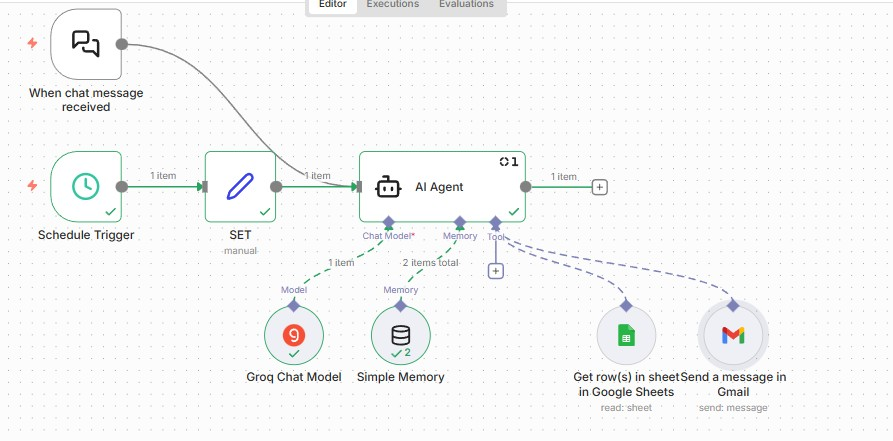
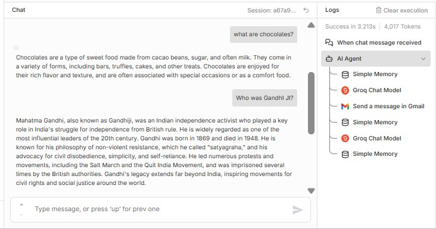

# personal-ai-assistant-n8n
Built a hybrid personal AI assistant using n8n and LLMs that supports chat and scheduled execution, maintains memory, and performs real-world actions like sending emails and interacting with Google Sheets.
# Personal AI Assistant (n8n + LLM)

## Overview
This project is a hybrid personal AI assistant built using n8n and large language models. 
It supports chat-based interaction as well as scheduled execution and can perform real-world actions using integrated tools.

## Features
- Chat-based interaction
- Scheduled autonomous execution
- Contextual memory
- Tool usage for real-world tasks

## Workflow Explanation
1. Chat or Schedule Trigger initiates the assistant
2. Input is prepared using a Set node
3. AI Agent processes the request using an LLM
4. Memory is used to retain context across interactions
5. The agent decides whether to call tools such as Gmail or Google Sheets
6. The result is returned or executed automatically

## Tools Integrated
- Gmail (send emails)
- Google Sheets (read data)

## Tech Stack
- n8n
- Groq LLM
- Simple Memory
- Gmail API
- Google Sheets API

## Key Learnings
- Designing agentic workflows
- Tool-based decision making with LLMs
- Managing conversational memory
- Building autonomous workflows with triggers

## Current Status
Functional personal AI assistant for learning and experimentation.

## Future Improvements
- Add more tools (Calendar, Notion, Tasks)
- Improve intent classification
- Role-based assistant behaviors

## Screenshots

### Workflow Overview

### AI Agent Configuration

### Successful Execution

